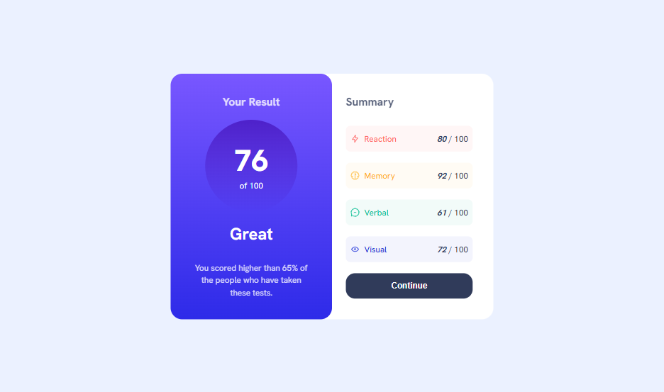

# Frontend Mentor - Results summary component solution

This is a solution to the [Results summary component challenge on Frontend Mentor](https://www.frontendmentor.io/challenges/results-summary-component-CE_K6s0maV). Frontend Mentor challenges help you improve your coding skills by building realistic projects.

## Table of contents

- [The challenge](#the-challenge)
- [Screenshot](#screenshot)
- [Links](#links)
- [Built with](#built-with)
- [What I learned](#what-i-learned)
- [Useful resources](#useful-resources)
- [Author](#author)

### The challenge

Users should be able to:

- View the optimal layout for the interface depending on their device's screen size
- See hover and focus states for all interactive elements on the page
- **Bonus**: Use the local JSON data to dynamically populate the content (Still working on it)

### Screenshot



### Links

- Solution URL: [Results summary component challenge on Frontend Mentor](https://www.frontendmentor.io/challenges/results-summary-component-CE_K6s0maV)
- Live Site URL: [Results summary component](https://jeanclaude09-dev.github.io/results-summary-component-main/)

### Built with

- Semantic HTML5 markup
- CSS custom properties
- Flexbox
- CSS Grid
- CSS Variables

### What I learned

- I have learned about CSS Gradient properties, I didn't know that it was that easy to implement
- I have learned that it is possible tu use a flex-box inside a grid without breaking it or unexpected behavior

I am really pround of:

```css
.result {
  background: linear-gradient(
    to bottom,
    var(--Light-slate-blue),
    var(--Light-royal-blue)
  );
}
```

```css
.result-score {
  display: flex;
  flex-direction: column;
  justify-content: center;
  align-items: center;
  background: linear-gradient(
    to bottom,
    var(--Violet-blue),
    var(--Persian-blue)
  );
  border-radius: 50%;
  width: 20rem;
  height: 20rem;
}
```

### Useful resources

While working on this challenge, I stumbled upon Kevin Powell’s YouTube channel. I had a great time going through his videos—especially the one on [CSS Gradients and repeating gradients](https://www.youtube.com/watch?v=4kWHW7da4U8) which really helped me out here!

## Author

- Frontend Mentor - [@jeanclaude09-dev](https://www.frontendmentor.io/profile/Jeanclaude09-dev)
- Instagram - [@iamje_claude](https://www.instagram.com/iamje_nclaude)
